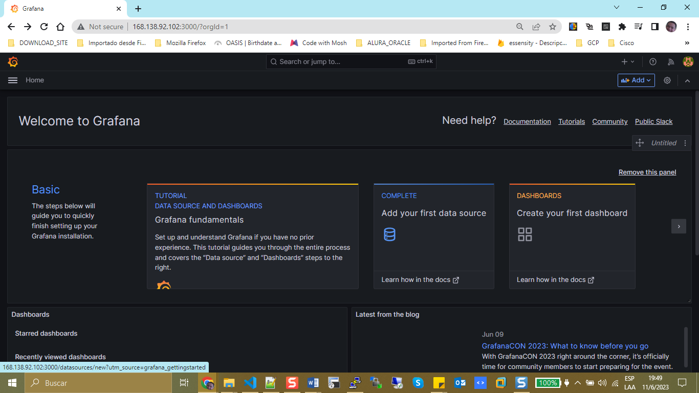
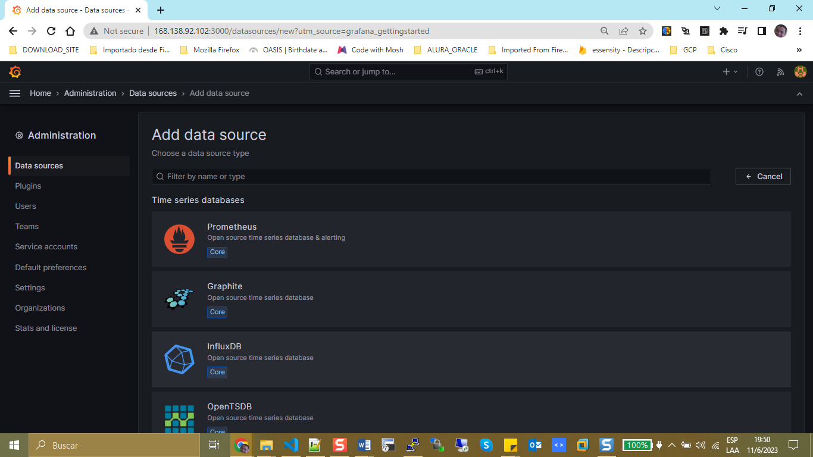
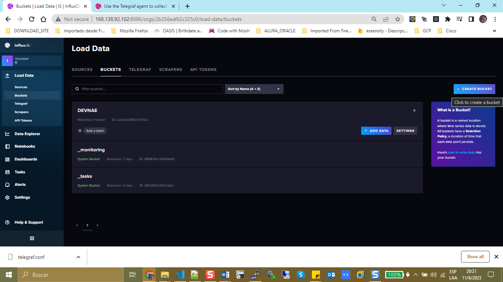
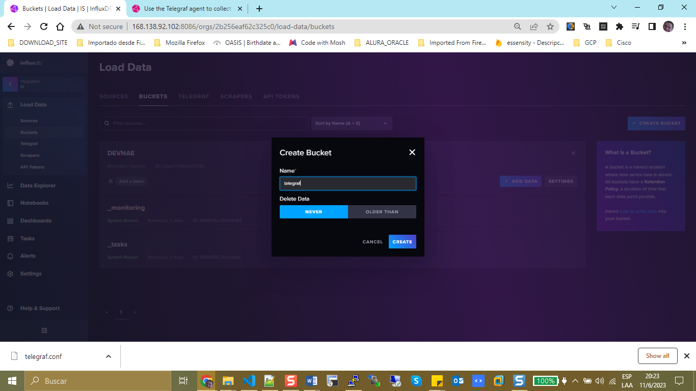
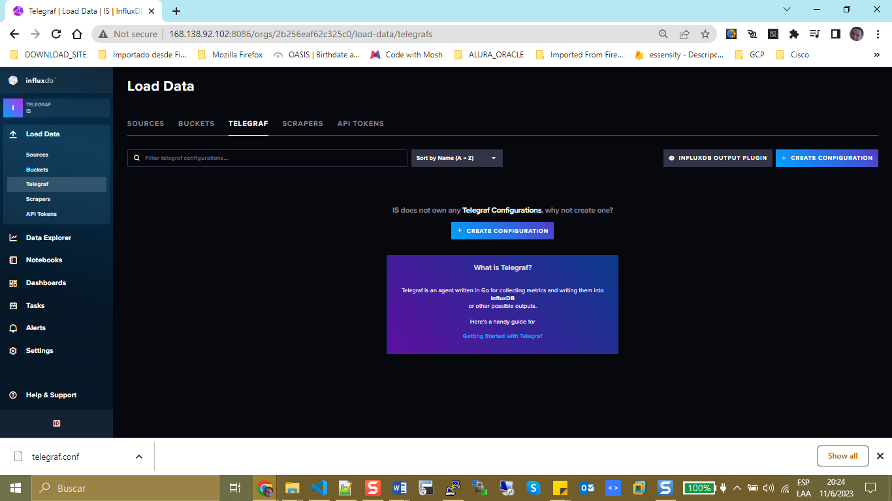
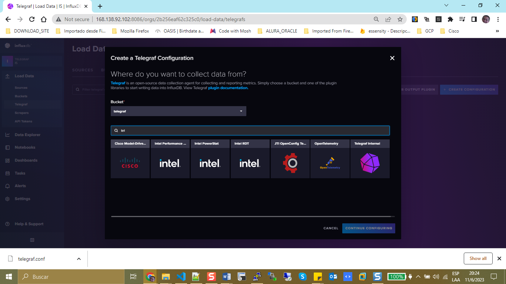
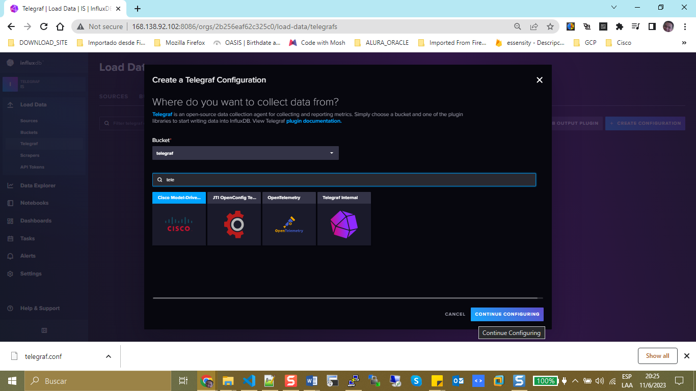
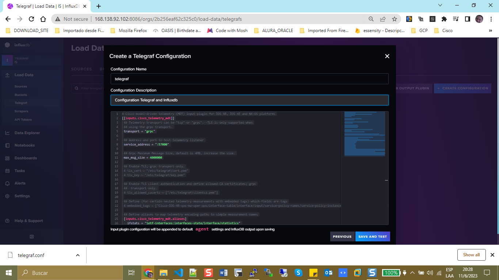
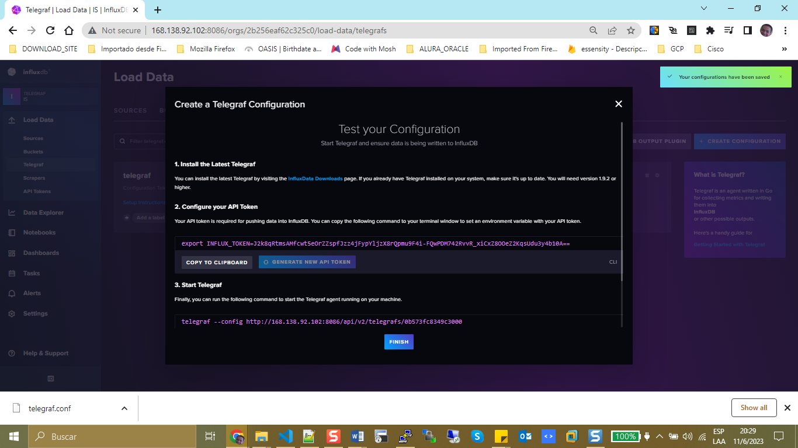

At this point you have installed all the services like grafana, telegraf and infludb.

# Grafana

+ You need to connect with Infludb, following this steps.

> Home > Data Source

> Select Infludb

+ Infludb integration with Telegraf

+ Create Bucket

database: telegraf

+ Integrate telegraf Connection

