# INSTALL CSR1000V IN WORKSTATION VMWARE

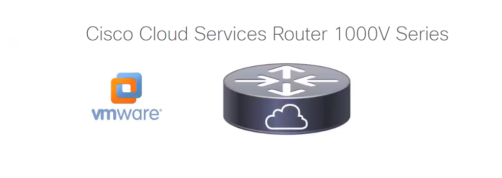

Previous this instalation you need to have your workstation instaled in your laptop. Download the image csr1000v-unversalk9.17.03.02.iso and csr1000v-unversalk9.17.03.02-vga.ovf in the oficial site www.cisco.com.

Model-Driven Telemetry gRPC Dial-Out support in Cisco IOS XE Gibraltar 16.10.1 or Cisco IOS XE Gibraltar 16.11.1 [MDT](https://www.cisco.com/c/en/us/td/docs/ios-xml/ios/prog/configuration/173/b_173_programmability_cg/model_driven_telemetry.html)

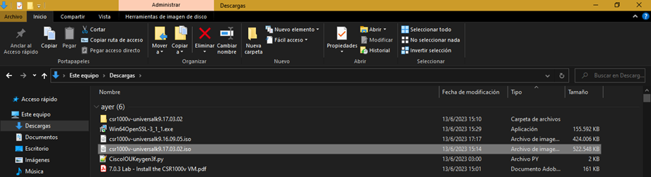

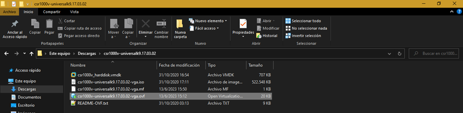

+ Open the file: csr1000v-unversalk9.17.03.02-vga.ovf 

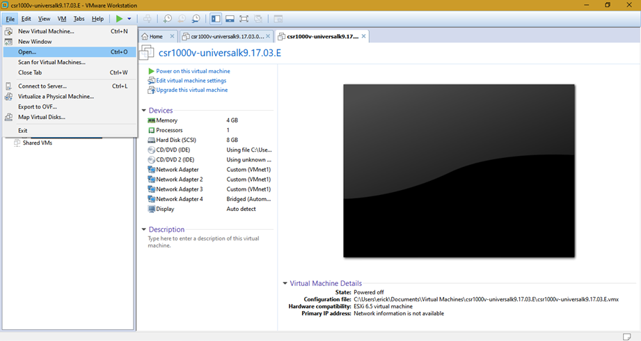

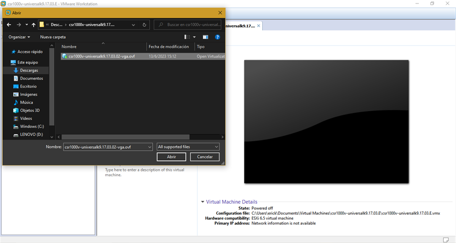

Follow these steps.

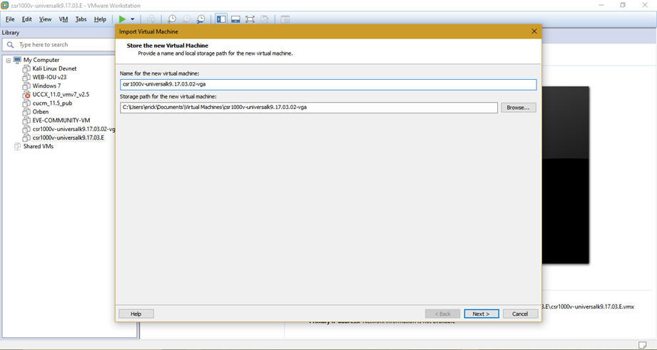

You can change the name here.
Name: CSR1000v

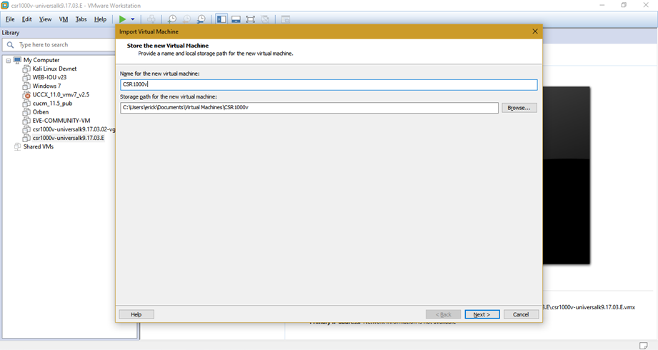

Select > option: Small

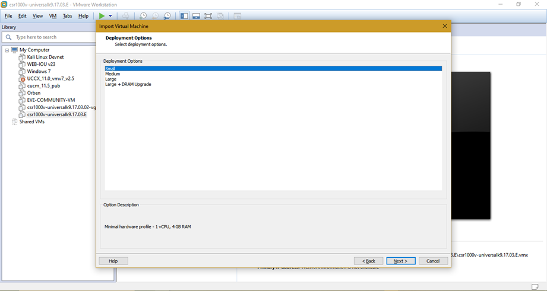

Maintain default configuration > Import

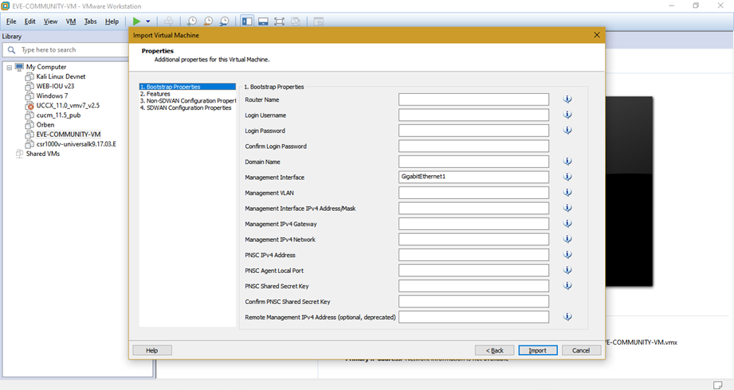

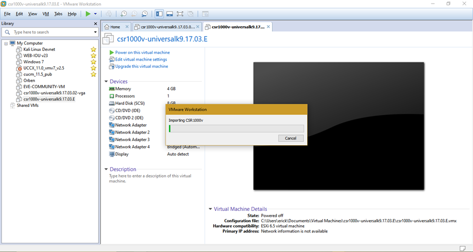

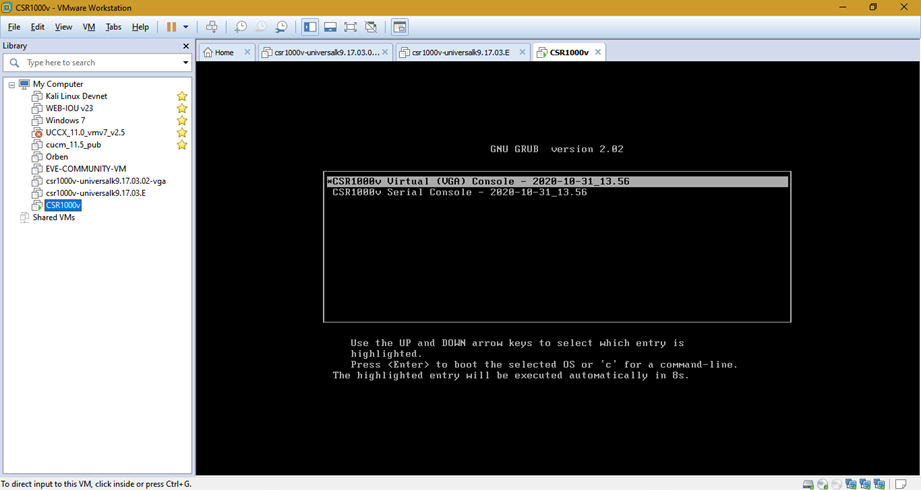

Execute Stop the process

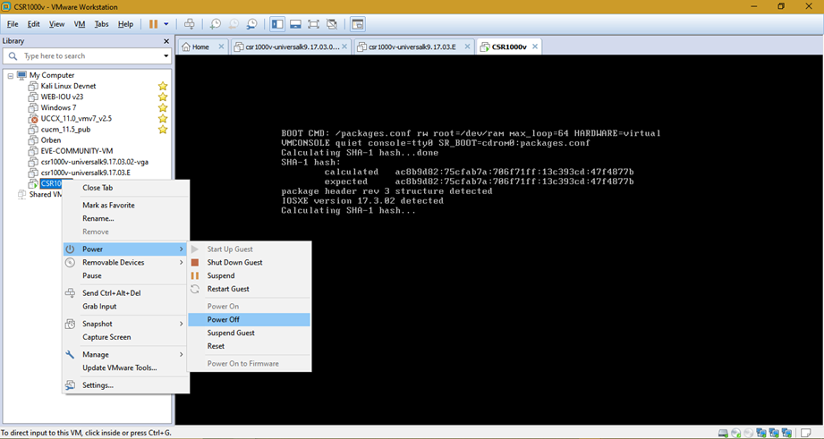

Select > Power Off

In this section, you need to modify the configuration.
Modify Network Adapter: VMnet1
RAM:4GB (this parameter is important!!!)
CD/DVD: select csr1000v-unversalk9.17.03.02.iso.iso

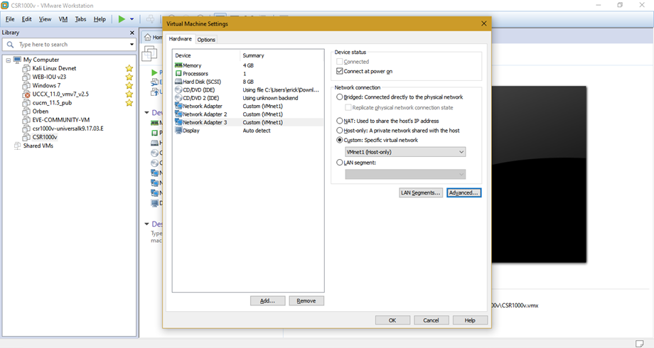

Select > csr1000-universal-xxx.iso

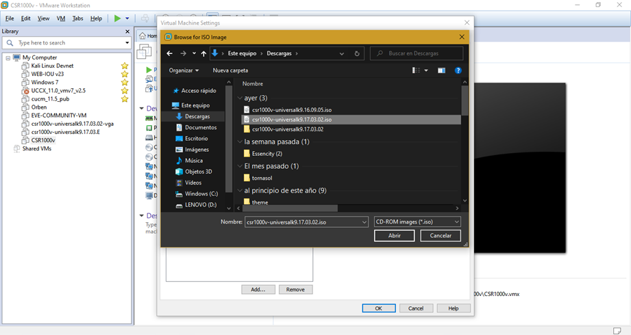

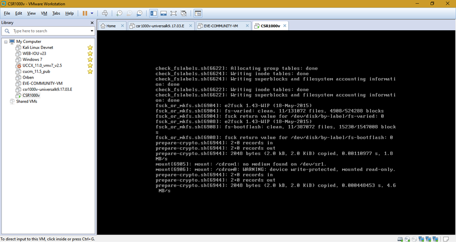

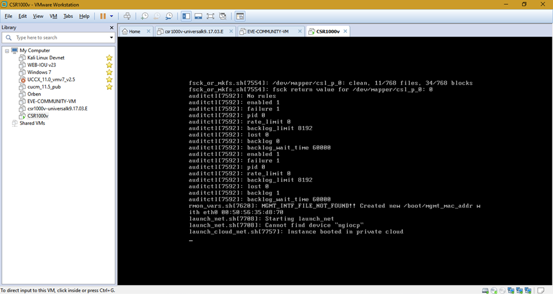

Second reboot de CD/DVD is turn off automatically.

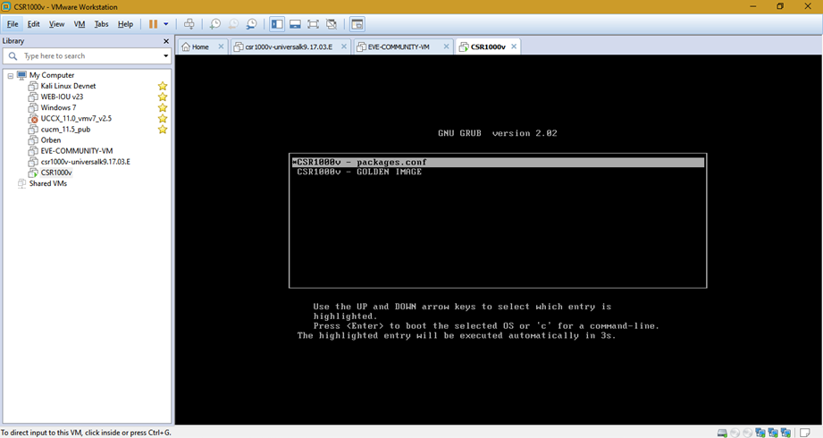

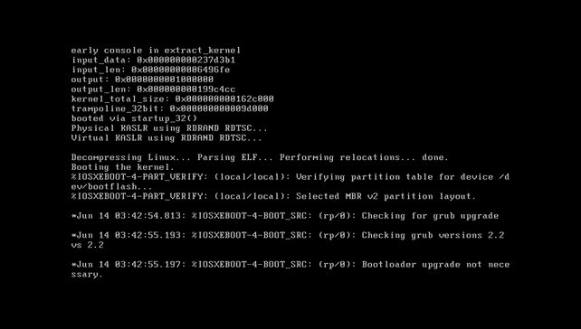

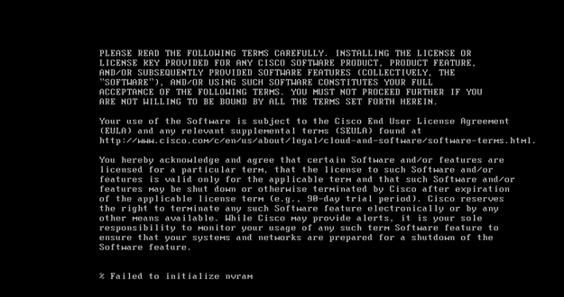

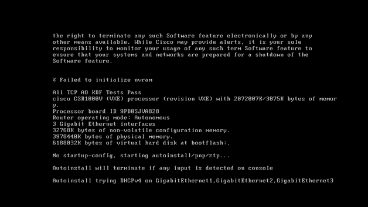

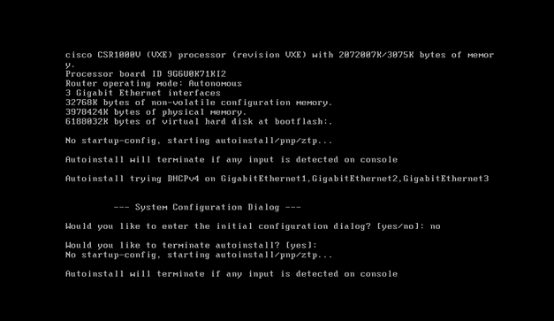

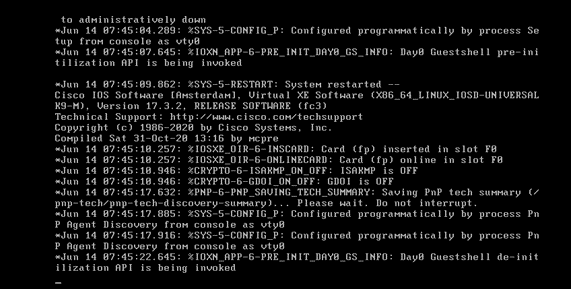

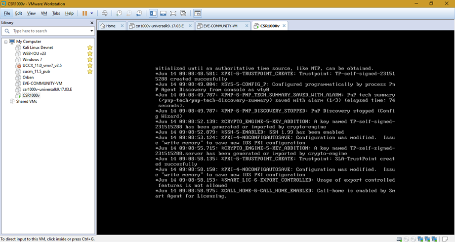

Press Enter

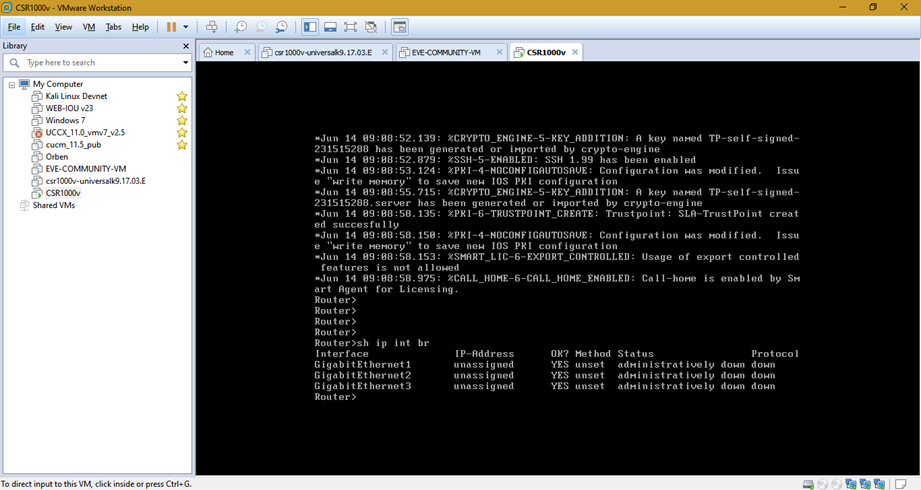

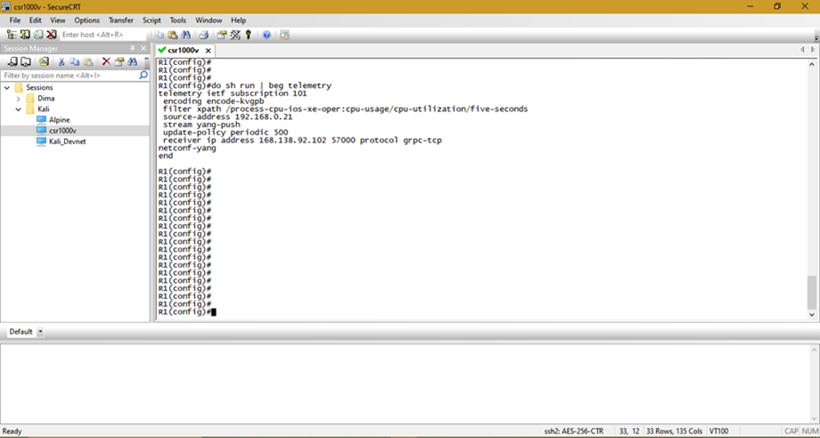

