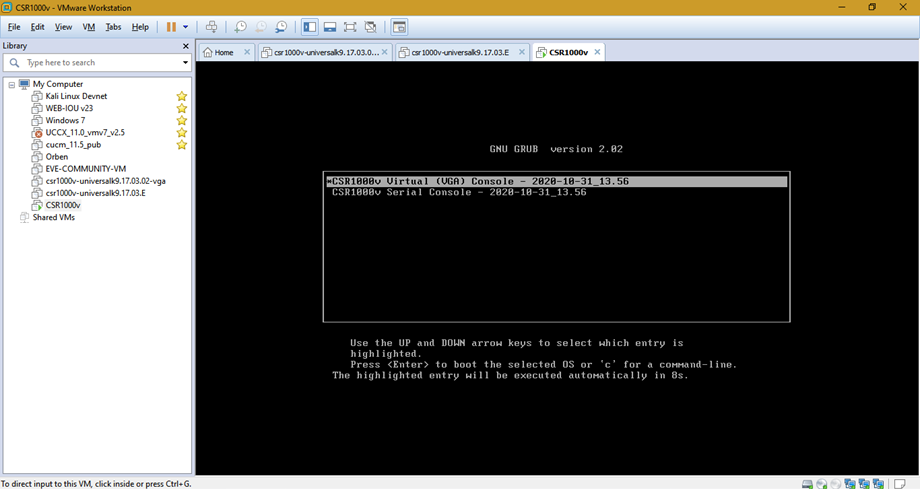
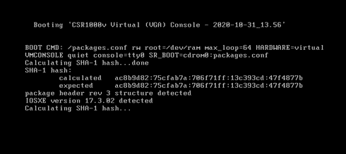
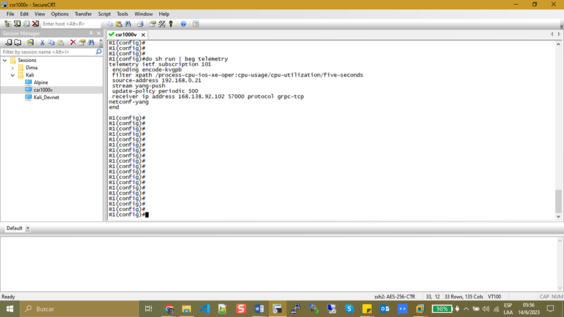

# INSTALL CSR1000V IN WORKSTATION VMWARE

Previous this instalation you need to have your workstation instaled in your laptop. Download the image csr1000v-unversalk9.17.03.02.iso and csr1000v-unversalk9.17.03.02-vga.ovf in the site www.cisco.com.

+ Open the file: csr1000v-unversalk9.17.03.02-vga.ovf 

Follow these steps.

You can change the name here.
Name: CSR1000v

Select > option: Small

Maintain default configuration > Import

Execute Stop the process

Select > Power Off
In this section, you need to modify the configuration.
Modify Network Adapter: VMnet1
RAM:4GB
CD/DVD: select image.iso

Select > csr1000-universal-xxx.iso

Second reboot de cd/DVD is turn off automatically.

Press Enter

