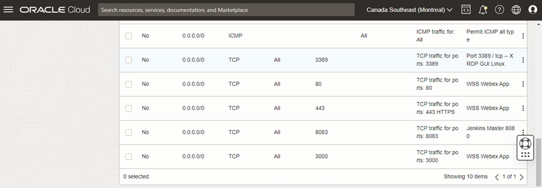

# Install Grafana


Add a repository Grafana in your machine redhat linux, following this steps.

```bash
opc@web-server ~]$ cd /etc/yum
yum/         yum.repos.d/ 

[opc@web-server ~]$ cd /etc/yum.repos.d/

[opc@web-server yum.repos.d]$ ls

epel-modular.repo  epel-testing-modular.repo  ksplice-ol8.repo  oci-included-ol8.repo  oraclelinux-developer-ol8.repo  remi-modular.repo        remi.repo       uek-ol8.repo
epel.repo          epel-testing.repo          mysql-ol8.repo    oracle-epel-ol8.repo   oracle-linux-ol8.repo           remi-php74.repo.rpmsave  remi-safe.repo  virt-ol8.repo

[opc@web-server yum.repos.d]$ sudo nano grafana.repo
```
Paste this code:

```yaml
[grafana]
name=grafana
baseurl=https://rpm.grafana.com
repo_gpgcheck=1
enabled=1
gpgcheck=1
gpgkey=https://rpm.grafana.com/gpg.key
sslverify=1
sslcacert=/etc/pki/tls/certs/ca-bundle.crt
```
Install grafana in your device.

```bash
[opc@web-server yum.repos.d]$ sudo yum install grafana

grafana                                                                                                                                               1.6 kB/s | 629  B     00:00    
grafana                                                                                                                                                31 kB/s | 2.4 kB     00:00    

### NOT starting on installation, please execute the following statements to configure grafana to start automatically using systemd
 sudo /bin/systemctl daemon-reload
 sudo /bin/systemctl enable grafana-server.service
### You can start grafana-server by executing
 sudo /bin/systemctl start grafana-server.service

Complete!
```
Enable grafana service.

```bash
[opc@web-server yum.repos.d]$ sudo systemctl start grafana-server
[opc@web-server yum.repos.d]$ sudo systemctl enable grafana-server

Synchronizing state of grafana-server.service with SysV service script with /usr/lib/systemd/systemd-sysv-install.
Executing: /usr/lib/systemd/systemd-sysv-install enable grafana-server
Created symlink /etc/systemd/system/multi-user.target.wants/grafana-server.service → /usr/lib/systemd/system/grafana-server.service.
```
Then validate your ip public

``` bash
[opc@web-server yum.repos.d]$ curl ifconfig.me

200.85.2.120
[opc@web-server yum.repos.d]$ 
```

After that, open port 3000 tcp in your server.

```bash
[opc@web-server yum.repos.d]$ sudo firewall-cmd --zone=public --permanent --add-port=3000/tcp
success

[opc@web-server yum.repos.d]$ sudo firewall-cmd --reload
success
```
Open port 3000 as well in your firewall.



Validate you service is up in your server.

```bash
[opc@web-server yum.repos.d]$ sudo systemctl status grafana-server
● grafana-server.service - Grafana instance
   Loaded: loaded (/usr/lib/systemd/system/grafana-server.service; enabled; vendor preset: disabled)
   Active: active (running) since Sun 2023-06-11 03:19:59 GMT; 19min ago
     Docs: http://docs.grafana.org
 Main PID: 2585692 (grafana)
    Tasks: 10 (limit: 5565)
   Memory: 144.9M
   CGroup: /system.slice/grafana-server.service
           └─2585692 /usr/share/grafana/bin/grafana server --config=/etc/grafana/grafana.ini --pidfile=/var/run/grafana/grafana-server.pid --packaging=rpm cfg:default.paths.logs=/va>
```
Open your browser and go to grafana site: https://x.x.x.x:3000/

Those are credentials to login your grafana server.

User: admin
Pass: admin


 
