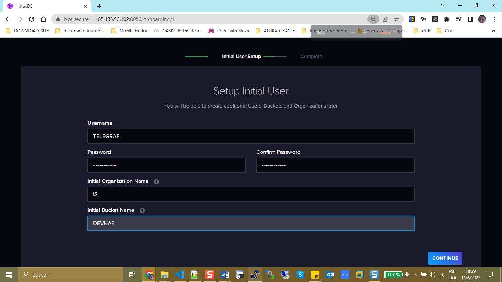

# Install InfluxDB

Following thouse steps to complete the instalation:

```bash
[opc@web-server telegraf]$ cat <<EOF | sudo tee /etc/yum.repos.d/influxdata.repo
> [influxdata]
> name = InfluxData Repository - Stable
> baseurl = https://repos.influxdata.com/stable/\$basearch/main
> enabled = 1
> gpgcheck = 1
> gpgkey = https://repos.influxdata.com/influxdata-archive_compat.key
> EOF
[influxdata]
name = InfluxData Repository - Stable
baseurl = https://repos.influxdata.com/stable/$basearch/main
enabled = 1
gpgcheck = 1
gpgkey = https://repos.influxdata.com/influxdata-archive_compat.key
[opc@web-server telegraf]$ 
[opc@web-server telegraf]$ 
[opc@web-server telegraf]$ 
[opc@web-server telegraf]$ 
[opc@web-server telegraf]$ 
[opc@web-server telegraf]$ 
[opc@web-server telegraf]$ 
[opc@web-server telegraf]$ sudo yum install influxdb2
InfluxData Repository - Stable                                                                               227 kB/s |  51 kB     00:00    
Dependencies resolved.
=============================================================================================================================================
 Package                           Architecture                   Version                           Repository                          Size
=============================================================================================================================================
Installing:
 influxdb2                         x86_64                         2.7.1-1                           influxdata                          44 M

Transaction Summary
=============================================================================================================================================
Install  1 Package

Total download size: 44 M
Installed size: 99 M
Is this ok [y/N]: y
Downloading Packages:
influxdb2-2.7.1.x86_64.rpm                                                                                    22 MB/s |  44 MB     00:01    
---------------------------------------------------------------------------------------------------------------------------------------------
Total                                                                                                         22 MB/s |  44 MB     00:01     
InfluxData Repository - Stable                                                                                14 kB/s | 1.6 kB     00:00    
Importing GPG key 0x7DF8B07E:
 Userid     : "InfluxData Package Signing Key <support@influxdata.com>"
 Fingerprint: 9D53 9D90 D332 8DC7 D6C8 D3B9 D8FF 8E1F 7DF8 B07E
 From       : https://repos.influxdata.com/influxdata-archive_compat.key
Is this ok [y/N]: y
Key imported successfully
Running transaction check
Transaction check succeeded.
Running transaction test
Transaction test succeeded.
Running transaction
  Preparing        :                                                                                                                     1/1 
  Running scriptlet: influxdb2-2.7.1-1.x86_64                                                                                            1/1 
  Installing       : influxdb2-2.7.1-1.x86_64                                                                                            1/1 
  Running scriptlet: influxdb2-2.7.1-1.x86_64                                                                                            1/1 
Created symlink /etc/systemd/system/influxd.service → /usr/lib/systemd/system/influxdb.service.
Created symlink /etc/systemd/system/multi-user.target.wants/influxdb.service → /usr/lib/systemd/system/influxdb.service.

  Verifying        : influxdb2-2.7.1-1.x86_64                                                                                            1/1 

Installed:
  influxdb2-2.7.1-1.x86_64                                                                                                                   

Complete!

```

After that, open port 8086 tcp in your server.

```bash
[opc@web-server yum.repos.d]$ sudo firewall-cmd --zone=public --permanent --add-port=8086/tcp
success

[opc@web-server yum.repos.d]$ sudo firewall-cmd --reload
success
```


+ Create Data Base in Influxb:




