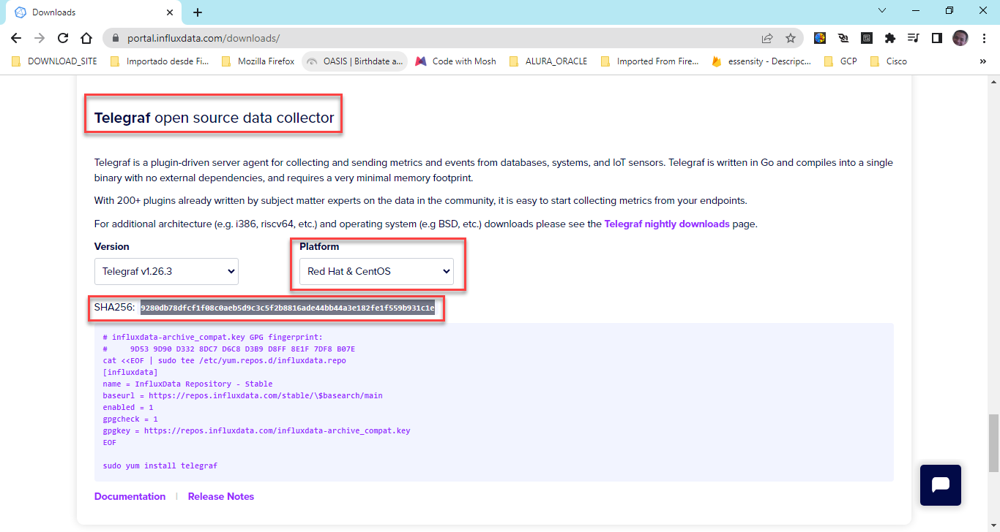
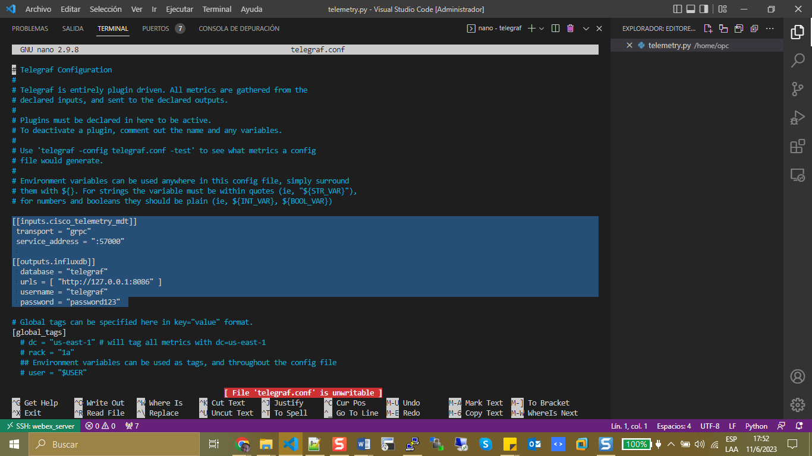

# Install Telegraf

Explore web site https://portal.influxdata.com/downloads/

Then search Telegraf Open Source and copie the SHA256.



Then clic in in Telegraf GitHub Releases https://github.com/influxdata/telegraf/releases

Looking for SHA256: 9280db78dfcf1f08c0aeb5d9c3c5f2b8816ade44bb44a3e182fe1f559b931c1e

Copy link address: from telegraf-1.26.3-1.x86_64.rpm and download in your linux server.

* Process Install Telegraf

```bash

[opc@web-server ~]$ wget https://dl.influxdata.com/telegraf/releases/telegraf-1.26.3-1.x86_64.rpm

[opc@web-server ~]$ ls
latest.tar.gz  telegraf-1.26.3-1.x86_64.rpm  telemetry.py
[opc@web-server ~]$ sudo yum install ./telegraf-1.26.3-1.x86_64.rpm
Last metadata expiration check: 1:54:02 ago on Sun 11 Jun 2023 07:17:33 PM GMT.
Dependencies resolved.
========================================================================================================== Package                          Architecture                   Version                          Repository                            Size
==========================================================================================================Installing:
 telegraf                         x86_64                         1.26.3-1                         @commandline                          47 M

Transaction Summary
==========================================================================================================Install  1 Package

Total size: 47 M
Installed size: 168 M
Is this ok [y/N]: y
Downloading Packages:
Running transaction check
Transaction check succeeded.
Running transaction test
Transaction test succeeded.
Running transaction
  Preparing        :                                                                                                                     1/1 
  Running scriptlet: telegraf-1.26.3-1.x86_64                                                                                            1/1 
  Installing       : telegraf-1.26.3-1.x86_64                                                                                            1/1 
  Running scriptlet: telegraf-1.26.3-1.x86_64                                                                                            1/1 
Created symlink /etc/systemd/system/multi-user.target.wants/telegraf.service → /usr/lib/systemd/system/telegraf.service.

  Verifying        : telegraf-1.26.3-1.x86_64                                                                                            1/1 

Installed:
  telegraf-1.26.3-1.x86_64                                                                                                                   

Complete!
```

Then you need to configure your server telegraf following this steps.

```bash
[opc@web-server telegraf]$ sudo systemctl status telegraf

● telegraf.service - Telegraf
   Loaded: loaded (/usr/lib/systemd/system/telegraf.service; enabled; vendor preset: disabled)
   Active: failed (Result: exit-code) since Sun 2023-06-11 21:27:03 GMT; 12min ago
     Docs: https://github.com/influxdata/telegraf
  Process: 2841529 ExecStart=/usr/bin/telegraf -config /etc/telegraf/telegraf.conf -config-directory /etc/telegraf/telegraf.d $TELEGRAF_OPTS>
 Main PID: 2841529 (code=exited, status=1/FAILURE)

Jun 11 21:27:03 web-server systemd[1]: telegraf.service: Main process exited, code=exited, status=1/FAILURE
Jun 11 21:27:03 web-server systemd[1]: telegraf.service: Failed with result 'exit-code'.
Jun 11 21:27:03 web-server systemd[1]: Failed to start Telegraf.
Jun 11 21:27:03 web-server systemd[1]: telegraf.service: Service RestartSec=100ms expired, scheduling restart.
Jun 11 21:27:03 web-server systemd[1]: telegraf.service: Scheduled restart job, restart counter is at 5.
Jun 11 21:27:03 web-server systemd[1]: Stopped Telegraf.
Jun 11 21:27:03 web-server systemd[1]: telegraf.service: Start request repeated too quickly.
Jun 11 21:27:03 web-server systemd[1]: telegraf.service: Failed with result 'exit-code'.
Jun 11 21:27:03 web-server systemd[1]: Failed to start Telegraf.

[opc@web-server telegraf]$ pwd
/etc/telegraf

[opc@web-server telegraf]$ ls -la

total 456
drwxr-xr-x.   3 root root     45 Jun 11 21:11 .
drwxr-xr-x. 119 root root   8192 Jun 11 21:12 ..
-rw-r--r--.   1 root root 453015 May 22 13:57 telegraf.conf
drwxr-xr-x.   2 root root     21 Jun 11 21:11 telegraf.d

[opc@web-server telegraf]$ sudo nano telegraf.conf

Add this commands: 

[[inputs.cisco_telemetry_mdt]]
 transport = "grpc"
 service_address = ":57000"

[[outputs.influxdb]]
  database = "telegraf"
  urls = [ "http://127.0.0.1:8086" ]
  username = "telegraf"
  password = "password123"



[opc@web-server telegraf]$ sudo firewall-cmd --zone=public --permanent --add-port=57000/tcp
success

[opc@web-server telegraf]$ sudo firewall-cmd --reload
success

[opc@web-server telegraf]$ sudo systemctl restart telegraf

[opc@web-server telegraf]$ sudo systemctl status telegraf
● telegraf.service - Telegraf
   Loaded: loaded (/usr/lib/systemd/system/telegraf.service; enabled; vendor preset: disabled)
   Active: active (running) since Sun 2023-06-11 21:48:44 GMT; 9s ago
     Docs: https://github.com/influxdata/telegraf
 Main PID: 2847290 (telegraf)
    Tasks: 8 (limit: 5565)
   Memory: 43.6M
   CGroup: /system.slice/telegraf.service
           └─2847290 /usr/bin/telegraf -config /etc/telegraf/telegraf.conf -config-directory /etc/telegraf/telegraf.d

Jun 11 21:48:44 web-server telegraf[2847290]: 2023-06-11T21:48:44Z I! Available plugins: 235 inputs, 9 aggregators, 27 processors, 22 parser>
Jun 11 21:48:44 web-server telegraf[2847290]: 2023-06-11T21:48:44Z I! Loaded inputs: cisco_telemetry_mdt cpu disk diskio kernel mem processe>
Jun 11 21:48:44 web-server telegraf[2847290]: 2023-06-11T21:48:44Z I! Loaded aggregators:
Jun 11 21:48:44 web-server telegraf[2847290]: 2023-06-11T21:48:44Z I! Loaded processors:
Jun 11 21:48:44 web-server telegraf[2847290]: 2023-06-11T21:48:44Z I! Loaded secretstores:
Jun 11 21:48:44 web-server telegraf[2847290]: 2023-06-11T21:48:44Z I! Loaded outputs: influxdb
Jun 11 21:48:44 web-server telegraf[2847290]: 2023-06-11T21:48:44Z I! Tags enabled: host=web-server
Jun 11 21:48:44 web-server telegraf[2847290]: 2023-06-11T21:48:44Z I! [agent] Config: Interval:10s, Quiet:false, Hostname:"web-server", Flus>
Jun 11 21:48:44 web-server systemd[1]: Started Telegraf.
Jun 11 21:48:44 web-server telegraf[2847290]: 2023-06-11T21:48:44Z W! [outputs.influxdb] When writing to [http://127.0.0.1:8086]: database ">

[opc@web-server telegraf]$ sudo systemctl enable telegraf
[opc@web-server telegraf]$ 
```

Verify status in the device:

```bash
Cat8000V(config)#do show telemetry ietf subscription 102 detail
Telemetry subscription detail:

  Subscription ID: 102
  Type: Configured
  State: Valid
  Stream: yang-push
  Filter:
    Filter type: xpath
    XPath: /process-cpu-ios-xe-oper:cpu-usage/cpu-utilization/five-seconds
  Update policy:
    Update Trigger: periodic
    Period: 500
  Encoding: encode-kvgpb
  Source VRF:
  Source Address:
  Notes: Subscription validated

  Named Receivers:
    Name                                              Last State Change  State                 Explanation
    -------------------------------------------------------------------------------------------------------------------------------------------------------
    grpc-tcp://168.138.92.102:57000                   06/11/23 21:59:26  Transport requested   Connection request in progress


```


