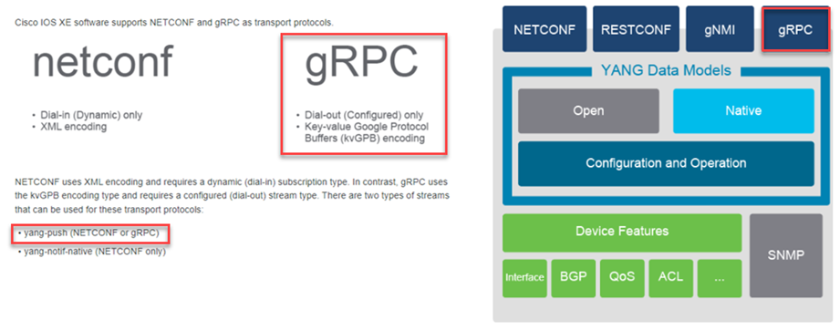

# Dial Out

We are going to work with transport protocol GRPC, dial-out work with encoding format kvGPB in the router CSR-XE 1000V.
the type stream that is supported is yang-push.



Login to Cisco Devenet Sandbox.

Login via SSH port 22 and validate version of Switch.

```bash
Cat8000V# sh version
Cisco IOS XE Software, Version 17.09.02a
Cisco IOS Software [Cupertino], Virtual XE Software (X86_64_LINUX_IOSD-UNIVERSALK9-M), Version 17.9.2a, RELEASE SOFTWARE (fc4)
Technical Support: http://www.cisco.com/techsupport
Copyright (c) 1986-2022 by Cisco Systems, Inc.
Compiled Wed 30-Nov-22 02:47 by mcpre


Cisco IOS-XE software, Copyright (c) 2005-2022 by cisco Systems, Inc.
All rights reserved.  Certain components of Cisco IOS-XE software are
licensed under the GNU General Public License ("GPL") Version 2.0.  The
software code licensed under GPL Version 2.0 is free software that comes
with ABSOLUTELY NO WARRANTY.  You can redistribute and/or modify such
GPL code under the terms of GPL Version 2.0.  For more details, see the
documentation or "License Notice" file accompanying the IOS-XE software,
or the applicable URL provided on the flyer accompanying the IOS-XE
software.


ROM: IOS-XE ROMMON

Cat8000V uptime is 1 hour, 28 minutes
Uptime for this control processor is 1 hour, 29 minutes
System returned to ROM by reload
System image file is "bootflash:packages.conf"
Last reload reason: reload


This product contains cryptographic features and is subject to United
States and local country laws governing import, export, transfer and
use. Delivery of Cisco cryptographic products does not imply
third-party authority to import, export, distribute or use encryption.
Importers, exporters, distributors and users are responsible for
compliance with U.S. and local country laws. By using this product you
agree to comply with applicable laws and regulations. If you are unable
to comply with U.S. and local laws, return this product immediately.

A summary of U.S. laws governing Cisco cryptographic products may be found at:
http://www.cisco.com/wwl/export/crypto/tool/stqrg.html

If you require further assistance please contact us by sending email to
export@cisco.com.

License Level:
License Type: Perpetual
Next reload license Level:

Addon License Level:
Addon License Type: Subscription
Next reload addon license Level:

The current throughput level is 20000 kbps


Smart Licensing Status: Smart Licensing Using Policy

cisco C8000V (VXE) processor (revision VXE) with 1980715K/3075K bytes of memory.
Processor board ID 9UWS2FADP45
Router operating mode: Autonomous
3 Gigabit Ethernet interfaces
32768K bytes of non-volatile configuration memory.
3965344K bytes of physical memory.
5234688K bytes of virtual hard disk at bootflash:.

Configuration register is 0x2102
```

Then you need to configure Telemetry in the device Cat8000V.

```yaml
Cat8000V(config)# telemetry ietf subscription 102
Cat8000V(config)# encoding encode-kvgpb
Cat8000V(config)# filter xpath /process-cpu-ios-xe-oper:cpu-usage/cpu-utilization/five-seconds
Cat8000V(config)# stream yang-push
Cat8000V(config)# update-policy periodic 500
Cat8000V(config)# receiver ip address 168.138.92.102 5700 protocol grpc-tcp
Cat8000V(config)# do sh run | sec netconf-yang

Cat8000V(config)# netconf-yang
```

Verify state of YANG process in the device.

```yaml
Cat8000V#show platform software yang-management process
confd            : Running
nesd             : Running
syncfd           : Running
ncsshd           : Running
dmiauthd         : Running
nginx            : Running
ndbmand          : Running
pubd             : Running
```

Verify the status about our subscription 102

```yaml
Cat8000V#show telemetry ietf subscription 102 detail
Telemetry subscription detail:

  Subscription ID: 102
  Type: Configured
  State: Valid
  Stream: yang-push
  Filter:
    Filter type: xpath
    XPath: /process-cpu-ios-xe-oper:cpu-usage/cpu-utilization/five-seconds
  Update policy:
    Update Trigger: periodic
    Period: 500
  Encoding: encode-kvgpb
  Source VRF:
  Source Address:
  Notes: Subscription validated

  Named Receivers:
    Name                                              Last State Change  State                 Explanation
    -------------------------------------------------------------------------------------------------------------------------------------------------------
    grpc-tcp://168.138.92.102:5700                    06/11/23 19:42:58  Resolving             Connection request in progress
```


