# Integration TIG

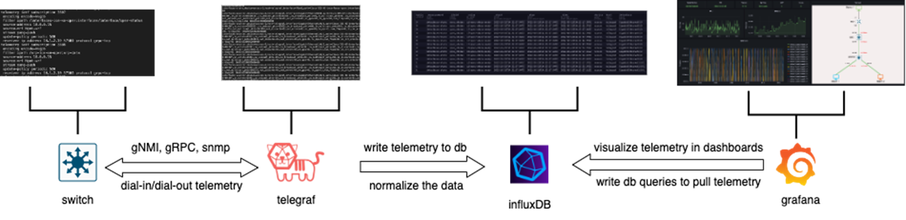

At this point you have installed all the services like grafana, telegraf and infludb.

# Integration Influxd and Grafana

+ You need to connect with Infludb, following this steps.

+ Go Home > Administration > Data Source

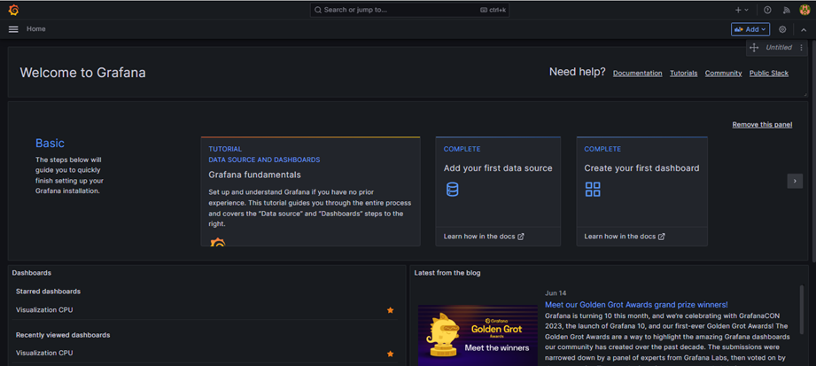

+ Select Influxdb

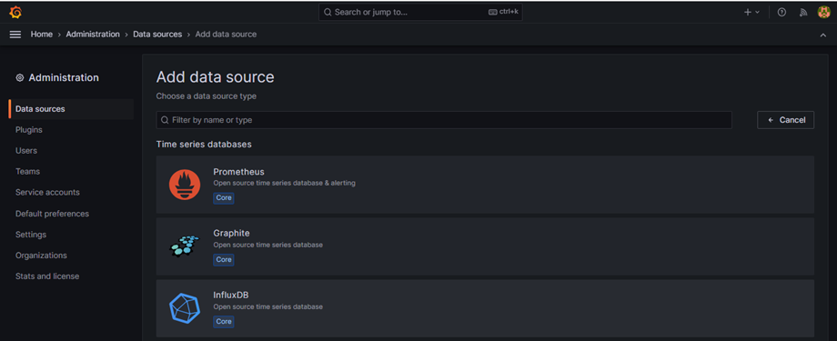

+ Open another browser and create a new API Token. In my case I created new one.

  Name: grafana

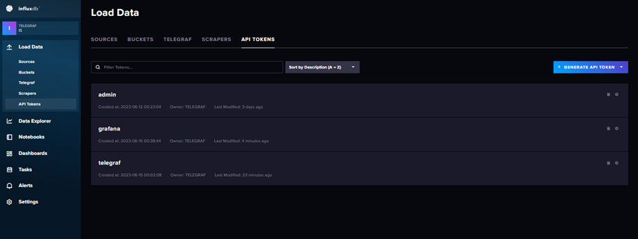

    + In Telegraf Server > Load Data >  Buckets 
      Name: telegraf

    + Create Bucket

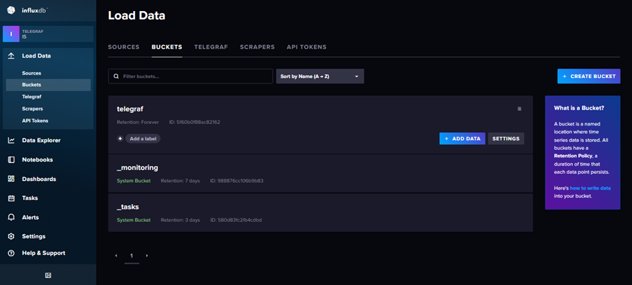

+ Verify your Organization Name

    + In Telegraf Server > Telegraf >  About 
      Name: IS

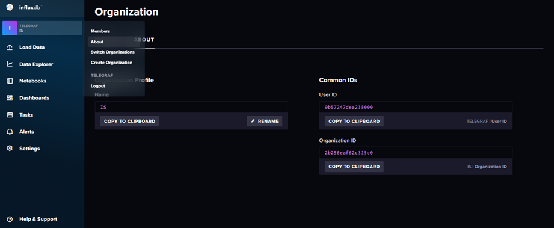

Now is time to go > Grafana Server

Grafana Server > Home > Administration > Data Sources

Configure with all the information that you obtained previously.

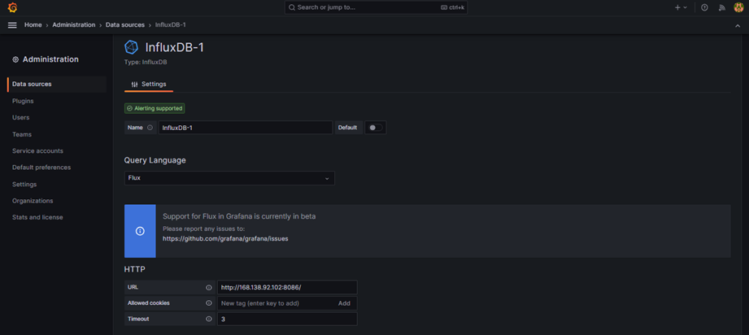

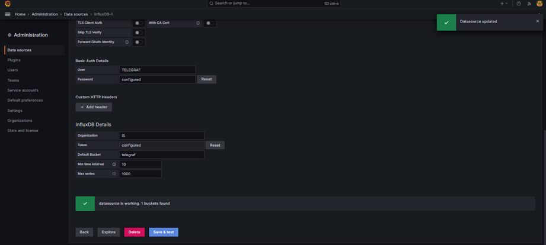

# Integration Telegraf and Fluxdb

To connect telegraf with fluxdb you need to navigate Influxdb > Load Data > Telegraf > Create Configuration

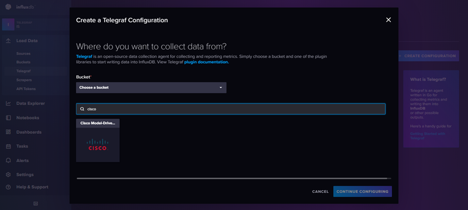

Name: mdt_cisco_plugin

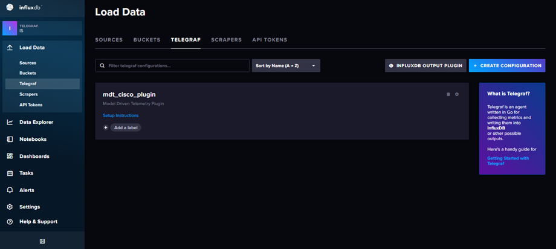

Select > mdt_cisco_plugin and Download Config

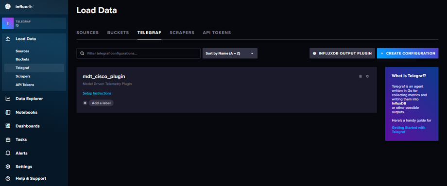

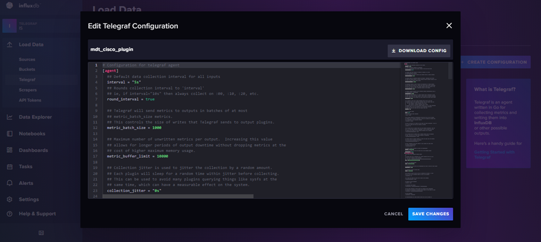

Then go > Influxdb > Load Data > API Tokens and create new one.

  Name: telegraf


+ Open a session SSH in your Grafana Server. We are going to store your token named telegraf in your system linux.

```yaml

[opc@web-server default]$ cd /etc/default

[opc@web-server default]$ pwd
/etc/default

[opc@web-server telegraf]$ cd /etc/default/

[opc@web-server default]$ ls

grub  influxdb2  telegraf  useradd

[opc@web-server default]$ ls -ll
total 16
-rw-r--r--. 1 root root 667 Jan 17 19:48 grub
-rw-r--r--. 1 root root  46 Jun 11 22:08 influxdb2
-rw-r--r--. 1 root root 104 Jun 15 17:23 telegraf
-rw-r--r--. 1 root root 119 Oct  2  2022 useradd

[opc@web-server default]$ cat telegraf 

INFLUX_TOKEN="1faT39jlDy84TV1pIwc7ThRbAq47oYqn1ZMtQ=="

[opc@web-server default]$ cd /etc/telegraf/

[opc@web-server telegraf]$ ls -ll
total 932
-rw----rw-. 1 root root 479062 Jun 15 18:56 telegraf.conf
drwxr-xr-x. 2 root root     21 Jun 15 15:14 telegraf.d
-rw-r--r--. 1 root root 474795 Jun 15 15:22 telegraf.sample
[opc@web-server telegraf]$ 

```
Also save your token as environment variable.

```yaml
[opc@web-server telegraf.d]$ export INFLUX_TOKEN="1faT39jlDy84TV1pIwc7ThRbAq47oYqn1ZMtQ=="

[opc@web-server telegraf.d]$ sudo nano ~/.bashrc

[opc@web-server telegraf.d]$ source ~/.bashrc

[opc@web-server telegraf.d]$echo $INFLUX_TOKEN

```


+ Modify file name: telegraf.conf

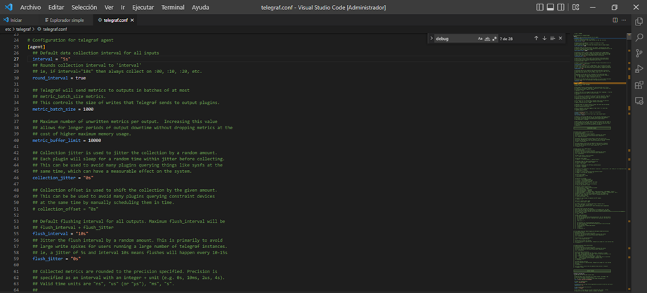

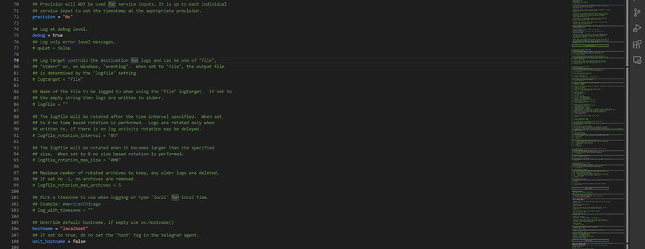

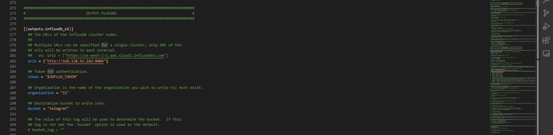

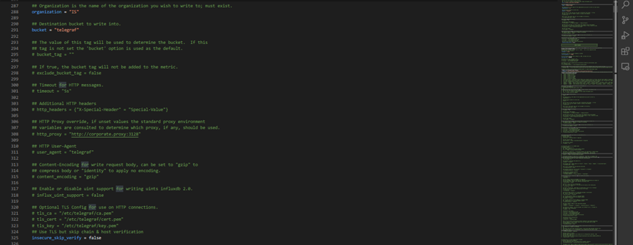

```bash
[opc@web-server telegraf]$ sudo systemctl restart telegraf
```

```bash
[opc@web-server telegraf]$ sudo systemctl status telegraf

● telegraf.service - Telegraf
   Loaded: loaded (/usr/lib/systemd/system/telegraf.service; enabled; vendor preset: disabled)
   Active: active (running) since Thu 2023-06-15 17:26:16 GMT; 2s ago
     Docs: https://github.com/influxdata/telegraf
 Main PID: 1073705 (telegraf)
    Tasks: 7 (limit: 5531)
   Memory: 50.8M
   CGroup: /system.slice/telegraf.service
           └─1073705 /usr/bin/telegraf -config /etc/telegraf/telegraf.conf -config-directory /etc/telegraf/telegraf.d

Jun 15 17:26:16 web-server telegraf[1073705]: 2023-06-15T17:26:16Z I! Starting Telegraf 1.27.0
Jun 15 17:26:16 web-server telegraf[1073705]: 2023-06-15T17:26:16Z I! Available plugins: 237 inputs, 9 aggregators, 28 processors, 23 parsers, 59 outputs, 4 secret-stores
Jun 15 17:26:16 web-server telegraf[1073705]: 2023-06-15T17:26:16Z I! Loaded inputs: cpu disk diskio kernel mem processes swap system
Jun 15 17:26:16 web-server telegraf[1073705]: 2023-06-15T17:26:16Z I! Loaded aggregators:
Jun 15 17:26:16 web-server telegraf[1073705]: 2023-06-15T17:26:16Z I! Loaded processors:
Jun 15 17:26:16 web-server telegraf[1073705]: 2023-06-15T17:26:16Z I! Loaded secretstores:
Jun 15 17:26:16 web-server telegraf[1073705]: 2023-06-15T17:26:16Z I! Loaded outputs: influxdb_v2
Jun 15 17:26:16 web-server telegraf[1073705]: 2023-06-15T17:26:16Z I! Tags enabled: host=localhost
Jun 15 17:26:16 web-server telegraf[1073705]: 2023-06-15T17:26:16Z I! [agent] Config: Interval:10s, Quiet:false, Hostname:"localhost", Flush Interval:10s
Jun 15 17:26:16 web-server systemd[1]: Started Telegraf.

[opc@web-server telegraf]$ 
```

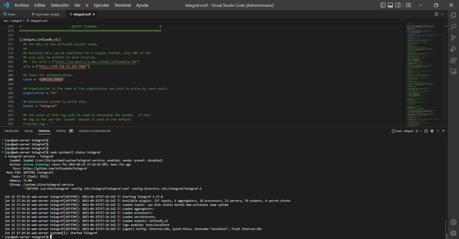

+ Then in the file telegraf.conf is necesary add our plugin previously downloaded.

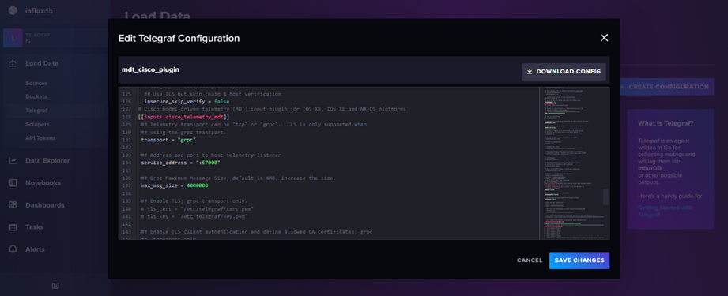

from "inputs.cisco_telemetry_mdt" needs to copy inside of file telegraf.conf

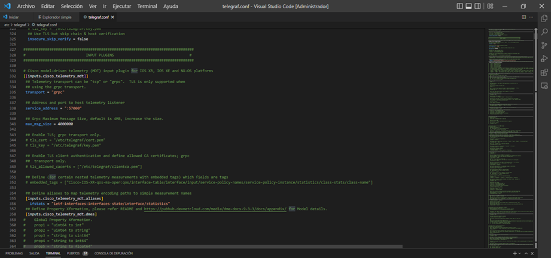

The example file telegraf.conf is on this repository. The you restart service telegraf.


```bash
[opc@web-server telegraf]$ sudo systemctl restart telegraf
```

```bash
[opc@web-server telegraf]$ sudo systemctl status telegraf

● telegraf.service - Telegraf
   Loaded: loaded (/usr/lib/systemd/system/telegraf.service; enabled; vendor preset: disabled)
   Active: active (running) since Thu 2023-06-15 17:26:16 GMT; 2s ago
     Docs: https://github.com/influxdata/telegraf
 Main PID: 1073705 (telegraf)
    Tasks: 7 (limit: 5531)
   Memory: 50.8M
   CGroup: /system.slice/telegraf.service
           └─1073705 /usr/bin/telegraf -config /etc/telegraf/telegraf.conf -config-directory /etc/telegraf/telegraf.d

Jun 15 17:26:16 web-server telegraf[1073705]: 2023-06-15T17:26:16Z I! Starting Telegraf 1.27.0
Jun 15 17:26:16 web-server telegraf[1073705]: 2023-06-15T17:26:16Z I! Available plugins: 237 inputs, 9 aggregators, 28 processors, 23 parsers, 59 outputs, 4 secret-stores
Jun 15 17:26:16 web-server telegraf[1073705]: 2023-06-15T17:26:16Z I! Loaded inputs: cpu disk diskio kernel mem processes swap system
Jun 15 17:26:16 web-server telegraf[1073705]: 2023-06-15T17:26:16Z I! Loaded aggregators:
Jun 15 17:26:16 web-server telegraf[1073705]: 2023-06-15T17:26:16Z I! Loaded processors:
Jun 15 17:26:16 web-server telegraf[1073705]: 2023-06-15T17:26:16Z I! Loaded secretstores:
Jun 15 17:26:16 web-server telegraf[1073705]: 2023-06-15T17:26:16Z I! Loaded outputs: influxdb_v2
Jun 15 17:26:16 web-server telegraf[1073705]: 2023-06-15T17:26:16Z I! Tags enabled: host=localhost
Jun 15 17:26:16 web-server telegraf[1073705]: 2023-06-15T17:26:16Z I! [agent] Config: Interval:10s, Quiet:false, Hostname:"localhost", Flush Interval:10s
Jun 15 17:26:16 web-server systemd[1]: Started Telegraf.

[opc@web-server telegraf]$ 
```

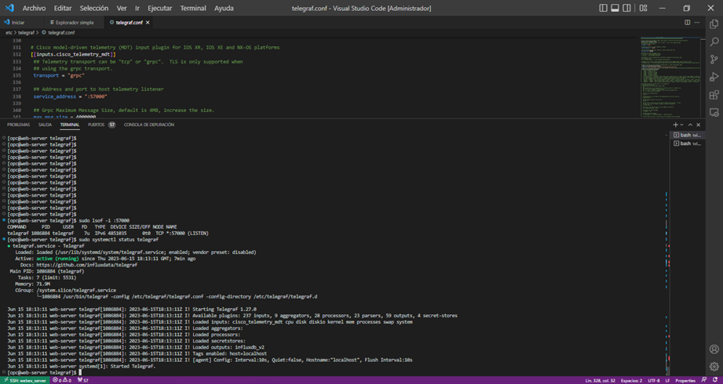

After that you can see the session using this command.

```bash
[opc@web-server telegraf]$ sudo lsof -i :57000

COMMAND      PID     USER   FD   TYPE  DEVICE SIZE/OFF NODE NAME
telegraf 1086884 telegraf    7u  IPv6 4851035      0t0  TCP *:57000 (LISTEN)
tiempo real se ve el proceso, se debe activar debug:tru en el perfil telegraf.conf
```
+ Verify logs incomming on real time.

```bash
[opc@web-server telegraf]$ sudo journalctl -u telegraf -f
```
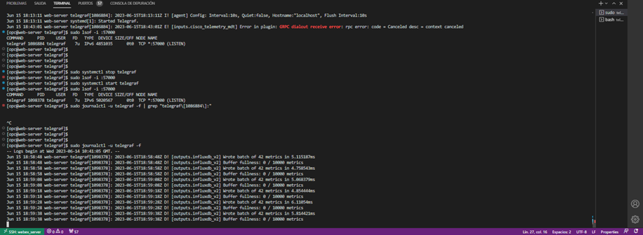

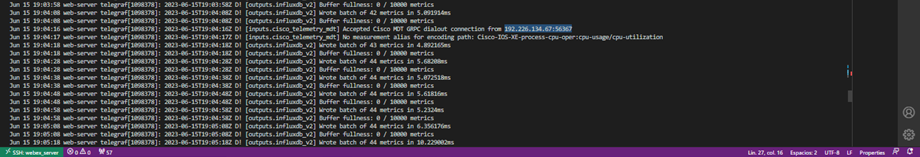

+ Other Commands 

Commands, that help in your day of troubleshooting.

```bash

[opc@web-server telegraf]$ sudo journalctl –xe
[opc@web-server telegraf]$ sudo journalctl -u telegraf.service
[opc@web-server telegraf]$ sudo lsof -i :57000
[opc@web-server telegraf]$ sudo journalctl -u telegraf -f
[opc@web-server telegraf]$ sudo systemctl status telegraf
[opc@web-server telegraf.d]$ env | less

```
# Create Visualization

+ Influxdb Server > Data Explore > select telegraf > Cisco-IOS-XE > Five Seconds > Submit

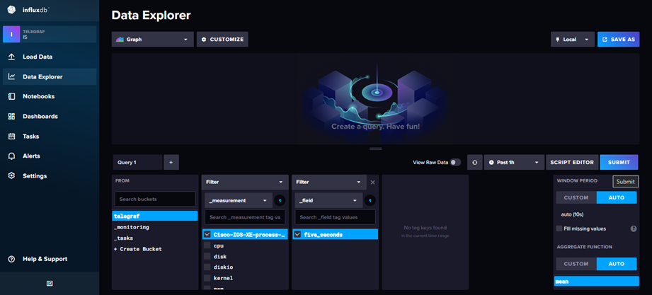

+ Then in the same page copy the code that provide script editor.

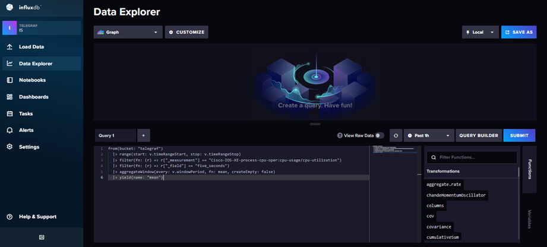

then go to Grafana Server and Select create new dashboard.

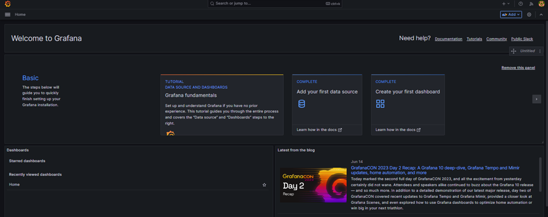

Copy the code provided by Influxdb and finally you see the CPU Visualization of your CSR 1000V.

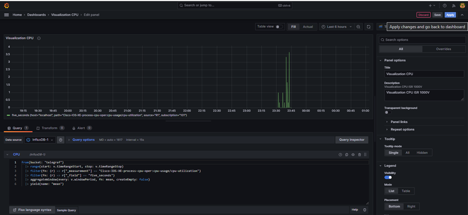

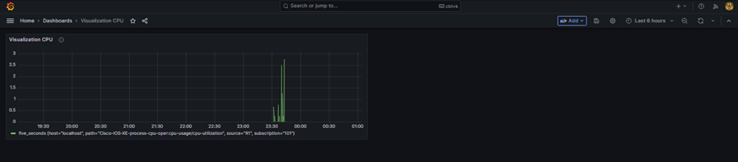

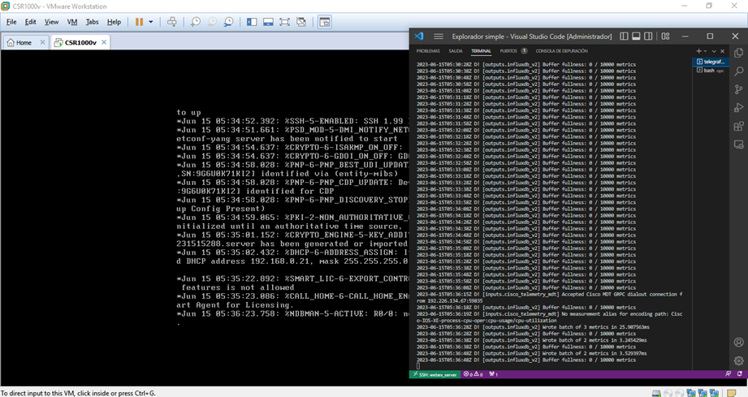
